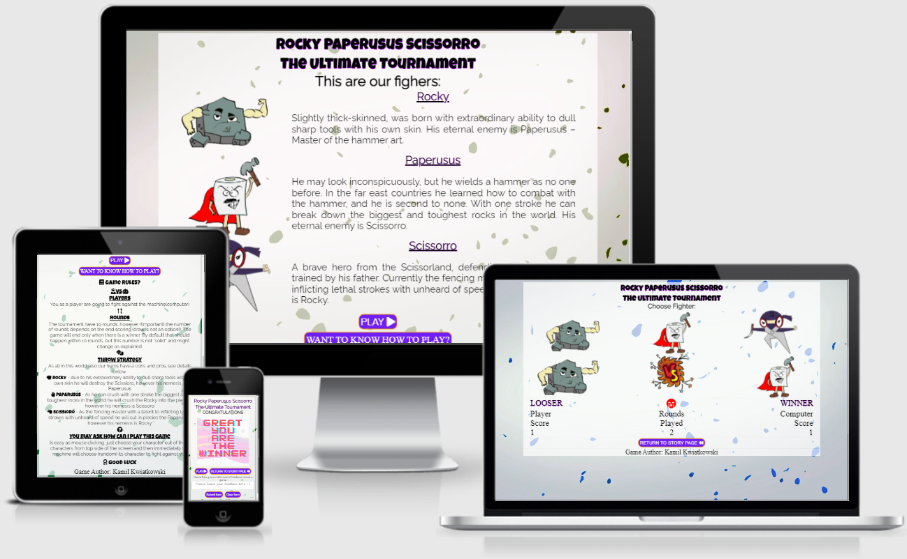

# Rocky Paperusus Scissorro ⛰️🧻✂️ The Ultimate Turnament 

# Introduction

Welcome to my second Full Stack Course project. This game is a modern twist on the popular game rock paper scissor. 

In this project my goal was to create intresting game - with original approach to rock paper scissor topic. As a Quality Engineer I'm a person who look for improvements opportunity in my daily basis, therefore I'm always keeping in back of my head words of **Ty Warner** (CEO of Ty Icn.) ***"Even perfection has room for improvement"***, what in case of my game can be translated as a perfect game with funny twist as improvement. 

Hope You will enjoy my project idea, and have lots of fun with.

# [See live webpage here](https://kamil-kw.github.io/Rocky_Paperusus_Scissorro/)

# Table of Contents

[1. **UX**](#ux)
* [**1.1. Strategy**](#strategy)
    * [Project Goals](#projectGoals)
    * [User target](#userTarget)
    * [1st time visitors](#firstTime)
    * [Returning visitors](#returning)
    * [User expectations](#userExpectations)

* [**1.2. Structure**](#structure)
* [**1.3. Skeleton**](#skeleton)
* [**1.4. Surface**](#surface)

[2. **Features**](#features)

[3. **Technologies Used**](#technologies)

[4. **Testing**](#testing)

[5. **Development Cycle**](#development)

[6. **Deployment**](#deployment)

[7. **End Product**](#endProduct)

[8. **Known Bugs**](#knownBugs)

[9. **Credit**](#credits)

[Back to Table Of Content](#tableOfContents)

# 1. UX

As a part of my path of becoming a software developer from zero to hero 😊, I'm presenting a Rock Paperusus Scissorro game.

As mentioned in my first project my ultimate goal is to change my career path and become a full time developer, therefore my second project will be showing my new acquired skill which is JavaScript in the real project. 

One of the goals in this product was to draw attention of my potential employeers into this project and not be another one of the "next" rock paper scissors game out there, therefore I decided to use my creativity and build something new and original which can stay in memory for longer time than just simple version of this game.

[Back to Table Of Content](#tableOfContents)

# 1.1 Strategy

## Project Goals

The reason for this web page is to show my skills to potential recruiters and all who want to cooperate with me in the future in projects.

The website has been built by using HTML, CSS and JavaScript (the new skill on board 😊). 

[Back to Table Of Content](#tableOfContents)

## User Target

[Back to Table Of Content](#tableOfContents)

## First time visitors

* 1st time Visitors who wants to see my products;
* 1st time Visitors who wants to play a interesting game;

[Back to Table Of Content](#tableOfContents)

## Returning visitors

* Visitors who would like to play again;

[Back to Table Of Content](#tableOfContents)

## User Expectations

* Interface is easy to navigate;
* The website is responsive across all devices (mobile, tablet and desktop);
* Content is displayed in a clear and understanding format;
* To have the ability to leave feedback about the game experience and concept;

[Back to Table Of Content](#tableOfContents)

# 1.2. Structure

To be able to provide for users the best experience on devices which they use, my website has responsive design to cover the majority of currently used devices (mobile, tablet, laptop/desktop). 

***This has been tested and proven to be functional.***

* **All pages** with one consistent layout design being easy to understand and intuitive for all users;
* **Action buttons** located below middle sections (history, battlefield, lost/win image);
* **Footer** with copyrights and author name;
* **Story** includes short catchy/funny story about each character;
* **Game** include game with, section to choose character, battlefield, score of user and computer, and amount of rounds;
* **Lose and Win** include win or lost sentence, have ability to leave feedback by submitting the form. 

[Back to Table Of Content](#tableOfContents)

# 1.3. Skeleton

For creating wireframes I did use a [Balsamiq](https://balsamiq.com/), which helped me with defining layout for three types of devices (desktop, tablets and mobiles).

* **Homepage - Story Wireframes:**

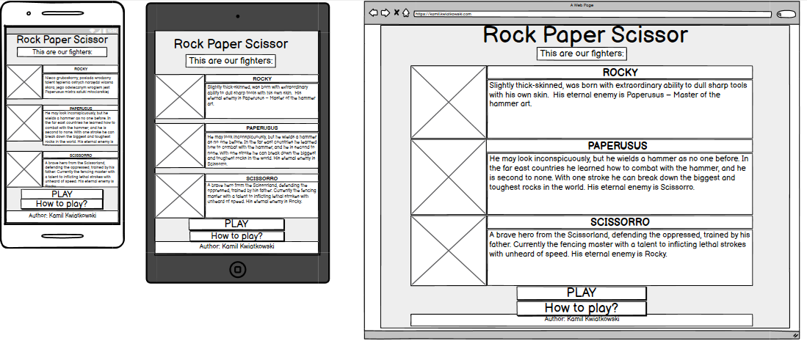

* **Homepage - Game Rules Wireframes:**

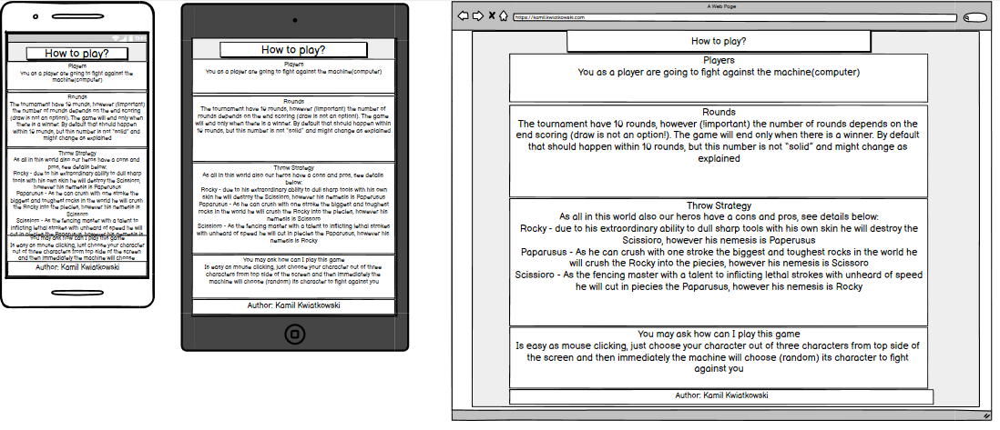

* **Game before start - the play game page before Wireframes:**

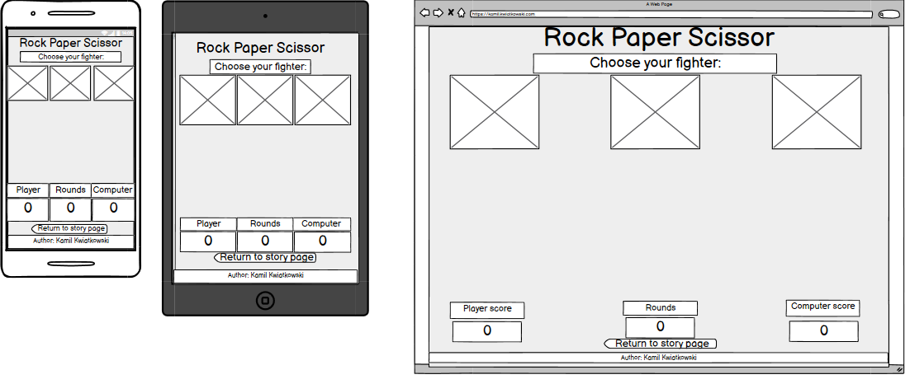

* **Game after start - the play game page after Wireframes:**

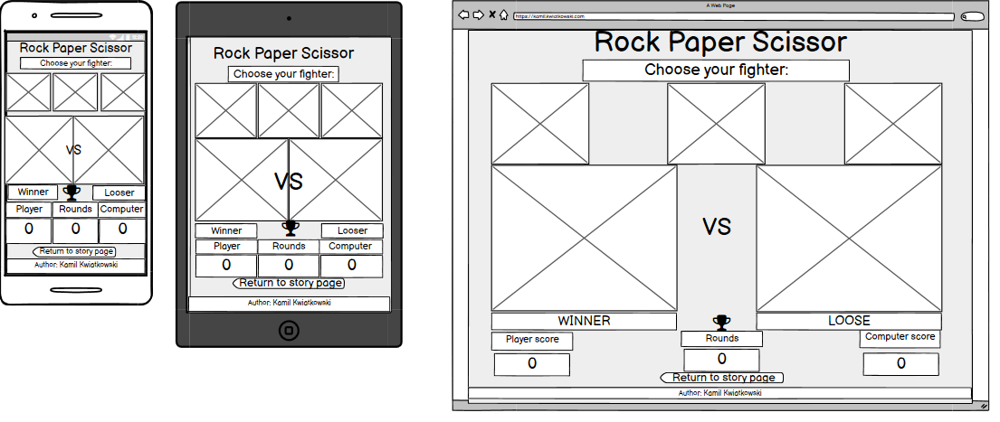

* **Lost - Lost page Wireframes:**

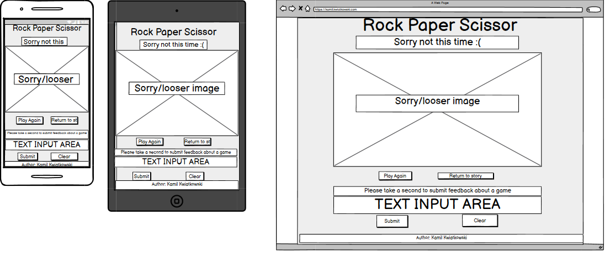

* **Win - Win page Wireframes:**

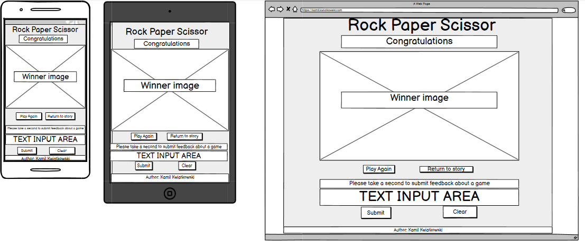
---

[Back to Table Of Content](#tableOfContents)

# 1.4. Surface

* **Typography**

* A font of my choice is Luckiest Guy & Raleway provided by [Google Fonts](https://fonts.google.com/).
    * As alternative font to Luckiest Guy, I used cursive font,
    * As alternative font to Raleway, I used sans-sarif font,

* **Background**

The background video used in my project was created and downloaded from [Giphy](https://giphy.com/).

* **Characters**
 
Characters were created Malgorzata Ostrowska (a graphic designer beginner) with using the Inkspace app.

* **Icons**

The icons were taken from [Font Awsome](https://fontawesome.com/)

* **Win and lost animation**

The Win and lost animation used in my project was created and downloaded from [Giphy](https://giphy.com/).

[Back to Table Of Content](#tableOfContents)

# 2. Features

### All pages:

A goal was to achieve a one consistent layout within all pages. This includes: 

* Consistent animated background was created by me using [Giphy](https://giphy.com/)

* Game title in top section of page;

* Comment to player e.g. 
    * **Story page:** "This are our fighters" 
    * **Game page:** "Choose Fighter" 
    * **Win page:** "Congratulation" 
    * **Lose page:** "Sorry not this time"

* Main section
    * **Story page:** Characters stories (catchy funny original), characters created specialy for this game (uniqe)
    * **Game page:** Battlefield area with score calculator and active icons (characters)
    * **Win page:** the congratulation image was created by me using [Canva](https://www.canva.com/)
    * **Lose page:** the you lost image was created by me using [Canva](https://www.canva.com/)

* Action buttons
    * **Story page:** Play
    * **Game page:** Return to story page
    * **Win page:** Return to story page and Play
    * **Lose page:** Return to story page and Play

* Feedback form only for last win/lost page including submit and clear form buttons

* Footer with author name

[Back to Table Of Content](#tableOfContents)

## Story page

* A short overview of game character, including funny/interesting story about each character

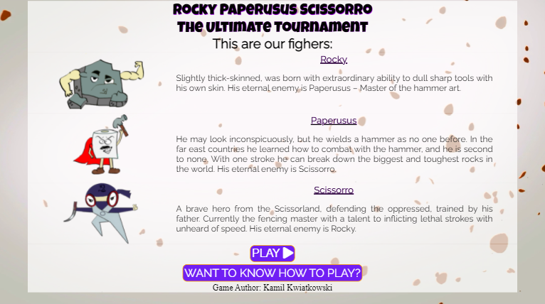

[Back to Table Of Content](#tableOfContents)

* Game rules revel after pressing **WANT TO KNOW HOW TO PLAY?** button

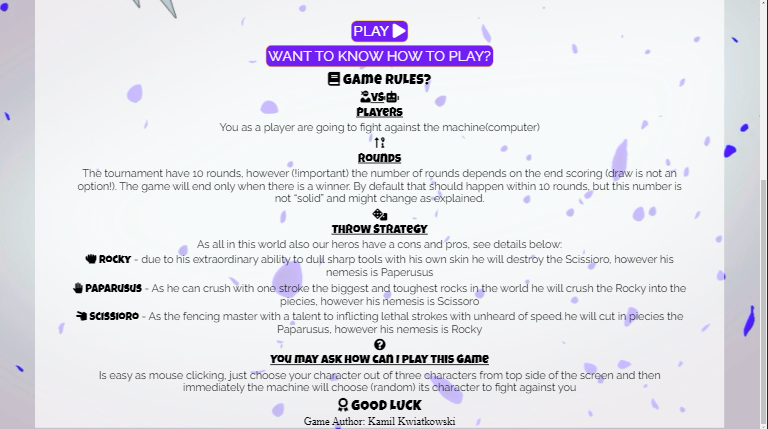

[Back to Table Of Content](#tableOfContents)

## Game page:

* A game page divided in sections to choose character, battlefield and score area.

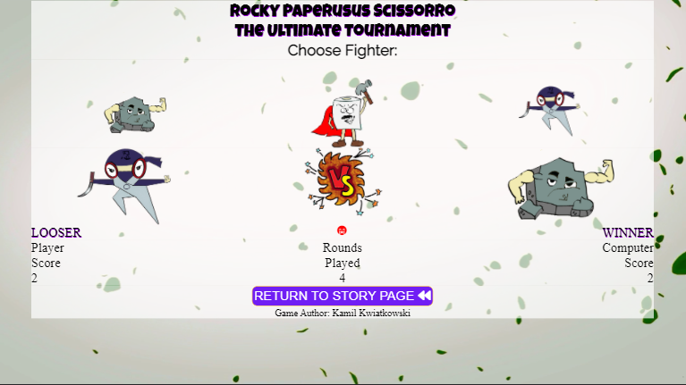

[Back to Table Of Content](#tableOfContents)

## Win page:

* A short message to player - "CONGRATULATIONS" 🏆, video created using [Canva](https://www.canva.com/)
* Feedback form

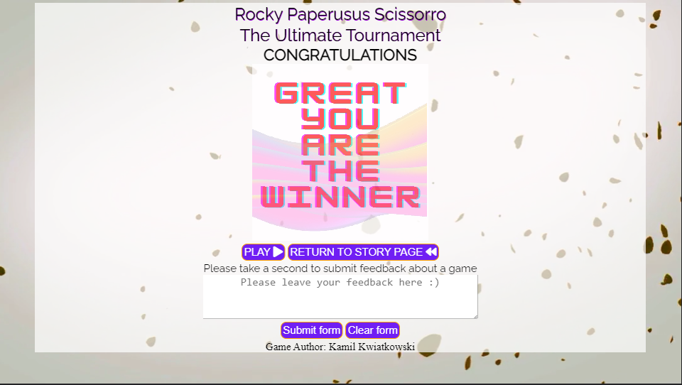

[Back to Table Of Content](#tableOfContents)

## Lose page:

* A short message to player - "Sorry not this time" 😢, video created using [Canva](https://www.canva.com/)
* Feedback form

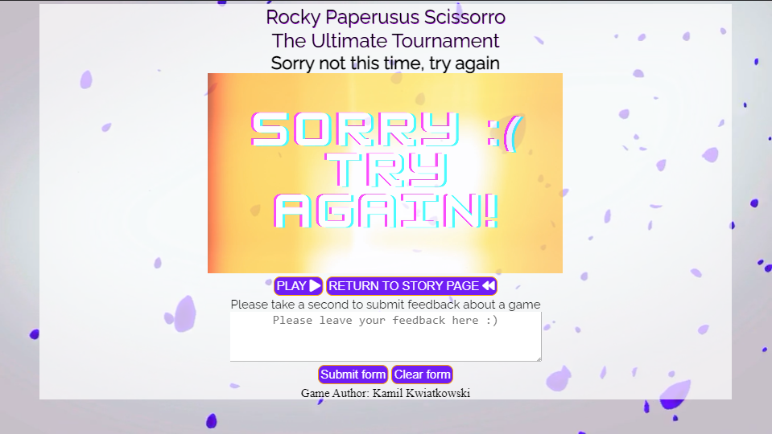

[Back to Table Of Content](#tableOfContents)

# 3. Technologies Used

During my page creation journey I did use:

* [HTML5](https://en.wikipedia.org/wiki/HTML)
    * Current project uses HyperText Markup Language.
* [CSS3](https://en.wikipedia.org/wiki/CSS)
    * Current project uses Cascading Style Sheets.
* [JavaScript](https://en.wikipedia.org/wiki/JavaScript)
    * My new friend 😁 on my path to become a software developer
* [Chrome](https://www.google.com/intl/en_uk/chrome/)
    * Chrome dev tool used to debug and test code while building
* [Balsamiq](https://balsamiq.com/)
    * To create wireframes during design
* [Google Fonts](https://fonts.google.com/)
    * Used as a source of Poppins font
* [Font Awsome](https://fontawesome.com/)
    * To provide icons to page
* [Github](http://github.com)
    * For storing project code written in gitpod
* [JS Fiddle](https://jsfiddle.net/)
    * Used as playground for code
* [W3C Markup](https://validator.w3.org/)
    * Validation tool to validate the HTML code and CSS style used in the project.
* [Jigsaw](https://jigsaw.w3.org/) 
    * Validation tool to validate the Javascript code style.
* [W3School](https://www.w3schools.com/)
    * For problem solving and code searching
* [Am I responsive design](http://ami.responsivedesign.is/)
    * To test responsiveness in end product and create readme screenshots
* [Beautifier - Free Formater](https://www.freeformatter.com/html-formatter.html) 
    * Used to improve HTML and CSS code presentation
* [Giphy](https://giphy.com/)
    * Used to create background and adding last page gif animation
* [Canva](https://www.canva.com/)
    * Used to create animated videos to the last pages 
* [Inkspace](https://inkscape.org/)
    * Used to create characters
* [Freeconvert](https://www.freeconvert.com/)
    * Used to convert tiff format to png (one of acceptable image formats allowing to have no background)
* [I Loving img](https://www.iloveimg.com/)
    * Used to crop images to correct size

[Back to Table Of Content](#tableOfContents)

# 4. Testing

### **Google developer Tool**

Used during entire project to test code and debug issues.

### **Responsive tools**

Used google dev tool to test responsiveness.

### **Lighthouse**

Used as a tool for improving the quality of web pages.

Lighthouse Score for Mobile devices:

***Story page Lighthouse Score**

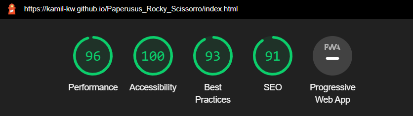

**Game page Lighthouse Score**

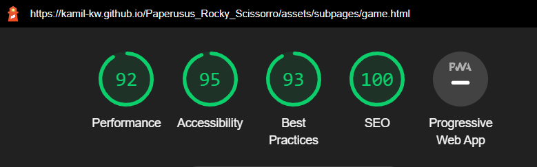

**Lost page Lighthouse Score**

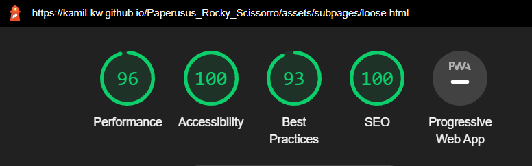

**Win page Lighthouse Score**

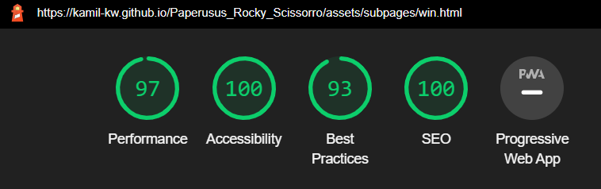

### **Am I responsive design**

[Am I responsive design](http://ami.responsivedesign.is/) used to test end product responsiveness.

[Back to Table Of Content](#tableOfContents)

### **Story screen from multiple devices**

**Laptop (14"):**

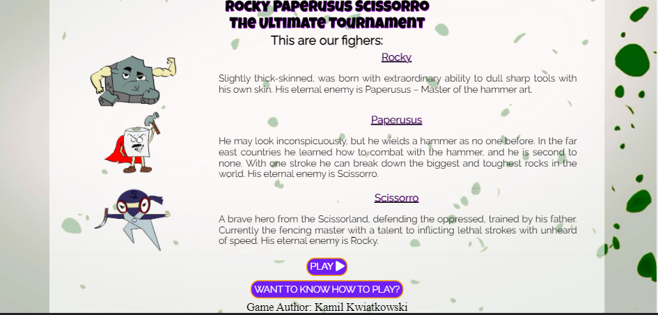

[Back to Table Of Content](#tableOfContents)

**Desktop (24"):**

[Back to Table Of Content](#tableOfContents)

**iPhone gen 6 up to 8:**

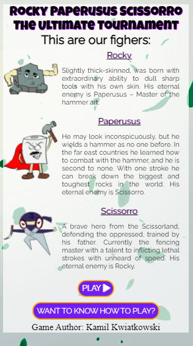

[Back to Table Of Content](#tableOfContents)

**iPhone plus gen 6 up to 8:**

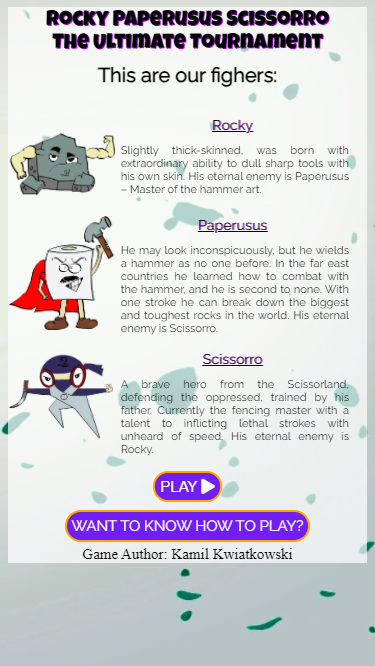

[Back to Table Of Content](#tableOfContents)

**iPad:**

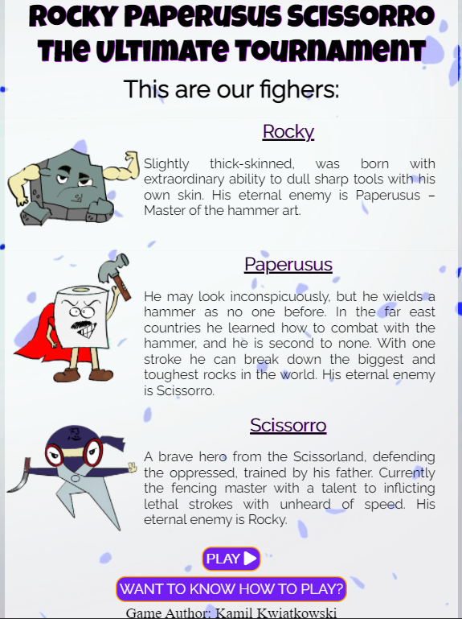

[Back to Table Of Content](#tableOfContents)

### **Story screen from multiple devices**

**Laptop (14"):**

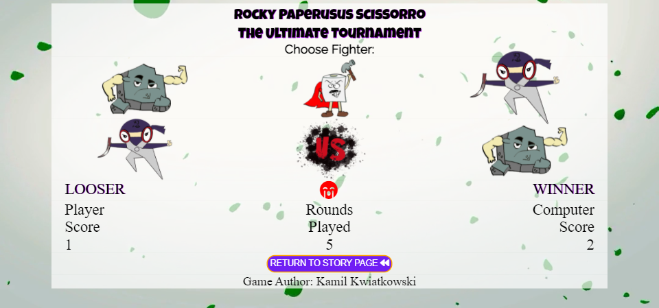

[Back to Table Of Content](#tableOfContents)

**Desktop (24"):**

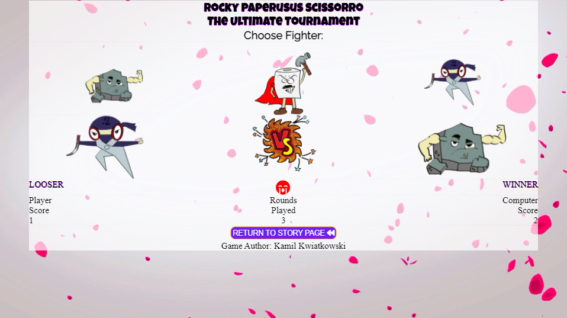

[Back to Table Of Content](#tableOfContents)

**iPhone gen 5:**

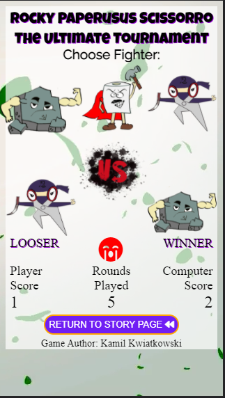

[Back to Table Of Content](#tableOfContents)

**iPhone gen 6 up to 8:**

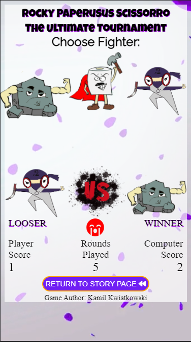

[Back to Table Of Content](#tableOfContents)

**iPhone plus gen 6 up to 8:**

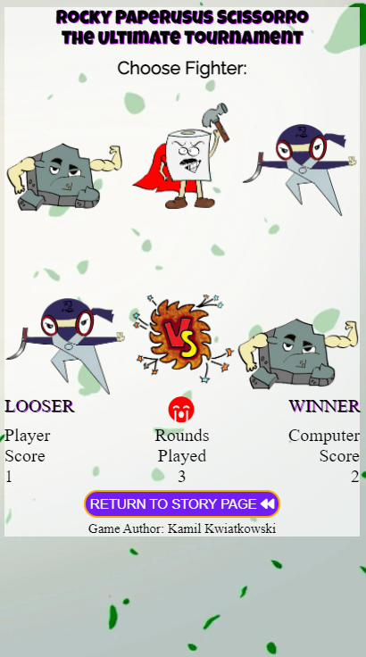

[Back to Table Of Content](#tableOfContents)

**iPad:**

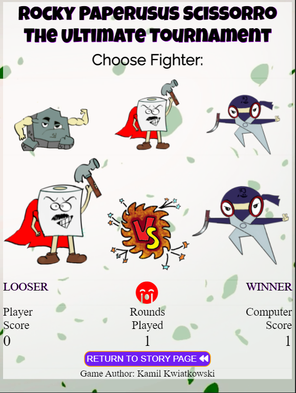

[Back to Table Of Content](#tableOfContents)

### W3C Validator tools

Tested by W3C validators, issues discovered:

* Incorrect structure of the button tag - fixed by removing anchor tag and replace with span tag

**All issues corrected.**

### JShint

Tested by W3C validators, issues discovered:

* ['myForm'] is better written in dot notation
* ['feedback'] is better written in dot notation

***Both errors with dot notation corrected**

## Manual testing

Page details:

**Action buttons:** 
    
All buttons have text color set to #701ef4 with orange border, to ensure good contrast.

* **Play** button will direct you to the Game page, will animate (transition in 0.5s) once pressed and change color to green.
* **WANT TO KNOW HOW TO PLAY?** button will expand game rules below;
* **RETURN TO STORY PAGE** button will direct you to the index page, will animate (transition in 0.5s) once pressed and change color to green.
* **Submit form** button once pressed will change color to green than check if feedback field is filled (using Java Script):
    * If NOT the page alert "Please leave feedback" will appear  
    * If YES than will direct you to [Code Institute - formdump](https://formdump.codeinstitute.net/) and open in it in the new tab

        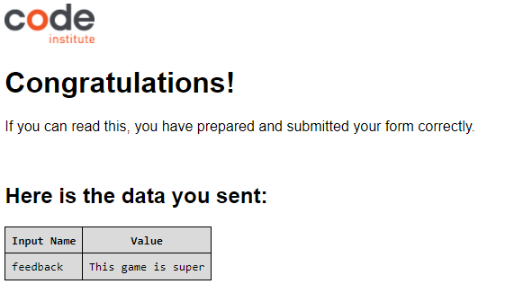
* **Clear form** button will clear all text from form (using Java Script).

 ***All buttons has pass tests and worked according to project expections.***

**Characters story:**

* Entire text was checked against grammatical issues and typos
* Entire text area received transparent background to improve contrast and maintain visibility of animated background
* Story will zoom to 110% to increase text size once mouse over the area - adding motion/interactivity to the page

***Characters story has pass tests and worked according to project expections.***

**Game rules:**
Expand once press the **WANT TO KNOW HOW TO PLAY?** button:
* Entire text was checked against grammatical issues and typos
* Entire text area received transparent background to improve contrast and UX
* A font awesome icons added to achieve game card style

***Game rules has pass tests and worked according to project expections.***

**Game buttons (choose fighter):**
 
* Characters images used instead of regular buttons, 
* Characters will zoom to 110% to show currently pointed hero (UX)

***Game buttons animation has pass tests and worked according to project expections.***

**Battlefield area:**

* Characters images will appear as per player and computer choice, 
* The VS image will popup in between chosen characters once first character will be clicked

***Battlefield area has pass all tests and worked according to project expections.***

***Score/result area:** 
* The player (left) and computer (right) result in text form will appear below chosen character
* As per player result (Win, Lost, Draw) the font awesome will appear
    * 🏆 **WINNER** - Trophy icon
    * 😭 **LOOSER** - Sad face icon 
    * 🤝 **DRAW** - Hand shake icon
* Player score will be calculated each time when player wins
* Computer score will be calculated each time when computer wins
* Rounds played will calculate each time the character is chosen

***Score/result area has pass all tests and worked according to project expections.***

**Win & lost page**

* Send button with color theme matching to all buttons, once pressed will check if field is filled than direct you to [Code Institute - formdump](https://formdump.codeinstitute.net/) and open in new tab;
* Clear form button with color theme matching to all buttons clear all text from form.
* Win & lost animation - video based (mp4) displayed once enter the page

***Win & lost pages pass tests and worked according to project expections.***

**Game logic:** 
* 3 characters to choose from (9 combinations)
* Total rounds 10
* No draw option (as this is The Ultimate Tournament 😂), game number will increase until one of the game parties will get a higher score.

***Game logic has pass all tests and worked according to project expections.***

**Footer:**

Include author name, styled to match the page designe, always on the bottom of the page.

***Footer worked according to project expections.***

**Responsiveness:**

Was checked at multiple device sizes to focus the majority of devices currently used worldwide.

***Responsiveness pass all tests and worked according to project expections.***

[Back to Table Of Content](#tableOfContents)

# 5. Development

* **All pages:**
 
    * Characters - during the first days of the project I did use different pictures for positioning and building game logic, however I changed it later to specially designed and created for this game characters.
    * Game rules added to first page as adviced by my Mentor Marcel Mulders, list reveal after pressing the **WANT TO KNOW HOW TO PLAY?** button 
    * Lost & win page image changed due to issues with performance and best practice discovered by Lighthouse test - created own mp4 in [Canva](https://www.canva.com/) to be displayed
    * Zoom for text and characters added to story page to improve interactivity and UX
    * Zoom for choose characters area added for improving user interactivity with characters and overall UX

[Back to Table Of Content](#tableOfContents)

# 5. Deployment

Web page deployed using GitHub

[See live webpage here](https://kamil-kw.github.io/Paperusus_Rocky_Scissorro/index.html)

[Back to Table Of Content](#tableOfContents)

# 7. End Product

See End Product screens:

* **Story page:**

[Back to Table Of Content](#tableOfContents)

* **Game page:**

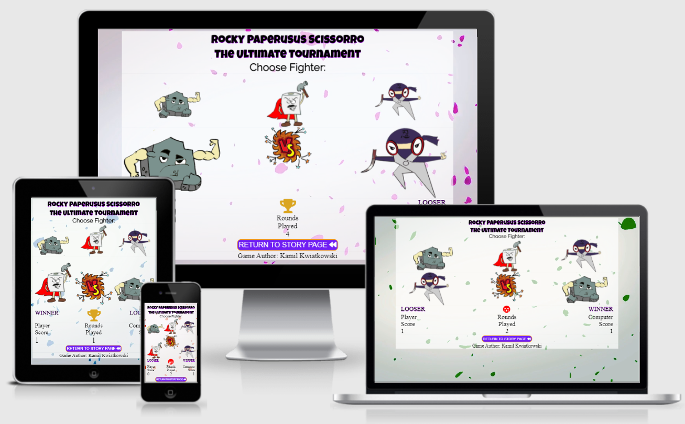

[Back to Table Of Content](#tableOfContents)

* **Win page:**

[Back to Table Of Content](#tableOfContents)

* **Lost page:**

[Back to Table Of Content](#tableOfContents)

# 8. Known bugs

* Incorrect structure of play and return button - cant be closed with anchor tag - rebuild to correct structure format
* Typo in line 22 of game.html - missing space button between attributes - space added
* incorrect structure of embedded file from giphy - "Error: The frameborder attribute on the iframe element is obsolete" - removed
* Poor score from lighthouse performance 89% due to external source of video (giphy), replacing video to own created using [Canva](https://www.canva.com/)
* Dot notation not used in form checker - fixed
* Unchecked runtime.lastError: The message port closed before a response was received - error caused by Norton browser extention
* Position of header diplaing over the .back (gray area) - fixed
* Position of score area causing poor UX, moved by 2vw to improve visibility

***All known bugs were corrected before deployment.***

[Back to Table Of Content](#tableOfContents)

# 9. Credits

* **Code:**

    * Icons came from [Font Awsome](https://fontawesome.com/)
    * Font came from [Google Fonts](https://fonts.google.com/)

* **Content:**

    * Background photo created & download from [Giphy](https://giphy.com/);
    * Win, Lost videos created & download from [Canva](https://www.canva.com/);
    * Characters created by Malgorzata Ostrowska (a graphic designer beginner)

Special thanks to:
@Marcel(Mentor) Mulder for constructive feedback and amazing tips 
Malgorzata Ostrowska for creating amazing characters
@Manni for providing feedback about the game which helps to improve UX

[Back to Table Of Content](#tableOfContents)