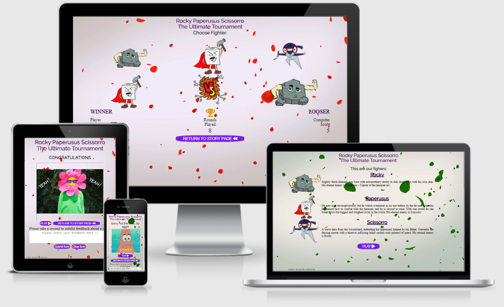

# Rock Paperusus Scissorro 
# ⛰️🧻✂️
# The Ultimate Turnament 

## Introduction

Welcome to my first Full Stack Course project. This page is my "Welcome World" project, a way for me to say Hi! to developers world. Webpage will tell you something more about myself and show my achievements.

# See live webpage [here](https://kamil-kw.github.io/Paperusus_Rocky_Scissorro/index.html)

## Table of Contents

[1. **UX**](#ux)

[* **1.1. Strategy**](#strategy)

[* Project Goals](#projectGoals)

[* User target](#userTarget)

[* 1st time visitors](#firstTime)

[* Returning visitors](#returning)

[* User expectations](#userExpectations)

[* **1.2. Structure**](#structure)

[* **1.3. Skeleton**](#skeleton)

[* **1.4. Surface**](#surface)

[2. **Features**](#features)

[3. **Technologies Used**](#technologies)

[4. **Testing**](#testing)

[5. **Development Cycle**](#development)

[6. **End Product**](#endProduct)

[7. **Known Bugs**](#knownBugs)

[8. **Credit**](#credits)

[Back to Table Of Content](#tableOfContents)

## 1. UX

As mention in my first project my ultimate goal is to change my career path and become a full time developer, therefore my second project will be a showing my new aqiured skill which is JavaScript in the real project.

As a part of my path of becoming a software developer from zero to hero 😊, I'm presenting a Rock Paperusus Scissorro game.

[Back to Table Of Content](#tableOfContents)

## 1.1 Strategy

[Back to Table Of Content](#tableOfContents)

### * Project Goals

The reason for this web page is to show my skills to potential recruiters and all who wants to cooperate with me in the future in projects. The website has been built by using HTML and CSS and new skill on board the JavaScript😊. 

[Back to Table Of Content](#tableOfContents)

### * User Target

[Back to Table Of Content](#tableOfContents)

### First time visitors:

* 1st time Visitors who wants to see my products;
* 1st time Visitors who wants to play a interesting game;

[Back to Table Of Content](#tableOfContents)

### Returning visitors:

* Visitors who would like to play again;

[Back to Table Of Content](#tableOfContents)

### User Expectations:

* Interface is easy to navigate;
* The website is responsive across all devices (mobile, tablet and desktop);
* Content is displayed in a clear and understanding format;
* To have the ability to leave feedback about the game expirence and concept;

[Back to Table Of Content](#tableOfContents)

## 1.2. Structure

To be able to provide for users the best experience on devices which they use, my website have responsive design to cover the majority of currently used devices (mobile, tablet, laptop/desktop). 

This has been tested and proven to be functional. 

* **All pages** with one consistent layout design being easy to understand and intuitive for all users;
* **Navigation buttons** located abouve the footer;
* **Footer** with copyrights and author name;
* **Story** includes short catchy/funny story about each character;
* **Game** include game with, section to choose character, battlefield, score of user and computer, and amount of rounds;
* **Lose and Win** include win or lost sentence, have abuility to leave feedback by submiting the form. 

[Back to Table Of Content](#tableOfContents)

## 1.3. Skeleton

For creating wireframes I did use a [Balsamiq](https://balsamiq.com/), which helped me with defining layout for three types of devices (desktop, tablets and mobiles).

* **Story - homepage Wireframes:**

* **Game before start - the play game page before Wireframes:**

* **Game after start - the play game page after Wireframes:**

* **Lose - Lose page Wireframes:**

* **Win - Lose page Wireframes:**

---

[Back to Table Of Content](#tableOfContents)

## 1.4. Surface

* **Typography**

A font of my choice is Luckiest Guy & Raleway provided by [Google Fonts](https://fonts.google.com/).
As alternative font to Luckiest Guy, I used cursive font,
As alternative font to Raleway, I used sans-sarif font,

* **Background**

The background video used in my project was taken from [Giphy](https://giphy.com/).

* **Characters**
 
Characters were created Malgorzata Ostrowska (a graphic designer begginer) with using the Inkspace app.

* **Icons**

The icons were taken from [Font Awsome](https://fontawesome.com/)

[Back to Table Of Content](#tableOfContents)

## 2. Features

### All pages:

A goal was to achieve a one consistent layout within all pages. This includes: 

* Game title in top section of page;

* Comment to player e.g. 
    **Story page:** "This are our fighters" 
    **Game page:** "Choose Fighter" 
    **Win page:** "Congratulation" 
    **Lose page:** "Sorry not this time"

* Main section
    **Story page:** Characters stories (catchy funny orginal) 
    **Game page:** Batelfield area with score calculator and active icons
    **Win page:** the congratulation image
    **Lose page:** the you lost image

* Action buttons
    **Story page:** Play
    **Game page:** Return to story page
    **Win page:** Return to story page and Play again
    **Lose page:** Return to story page and Play again

* Feedback form only for last (win. lost page) inluding submit and clear form buttons

* Footer with copyrights including author name

[Back to Table Of Content](#tableOfContents)

### Story page

* A short overview of game character, including funny/intrestiong story about each character

[Back to Table Of Content](#tableOfContents)

### Game page:

* A game page devided in section to choose character, battelfield and score area.

[Back to Table Of Content](#tableOfContents)

### Win page:

* A short message to player - "CONGRATULATIONS" 🏆, iframe from [Giphy](https://giphy.com/) and feedback form

### Lose page:

* A short message to player - "Sorry not this time" 😢, , iframe from [Giphy](https://giphy.com/) and feedback form

[Back to Table Of Content](#tableOfContents)

## 3. Technologies Used

During my page creation journey I did use:

* [HTML5](https://en.wikipedia.org/wiki/HTML)
    * Current project uses HyperText Markup Language.
* [CSS3](https://en.wikipedia.org/wiki/CSS)
    * Current project uses Cascading Style Sheets.
* [JavaScript](https://en.wikipedia.org/wiki/JavaScript)
    * Current project uses Cascading Style Sheets. My new firend 😁 on my becoming software developer path
* [Chrome](https://www.google.com/intl/en_uk/chrome/)
    * Chrome dev tool used to debug and test code while building
* [Balsamiq](https://balsamiq.com/)
    * To create wireframes during design
* [Google Fonts](https://fonts.google.com/)
    * Used as a source of Poppins font
* [Font Awsome](https://fontawesome.com/)
    * To provide icons to page
* [Github](http://github.com)
    * For storing project code written in gitpod
* [JS Fiddle](https://jsfiddle.net/)
    * Used as playground for code
* [W3School](https://www.w3schools.com/)
    * For problem solving and code searching
* [Am I responsive design](http://ami.responsivedesign.is/)
    * To test responsiveness in end product and create readme screen shots
* [Beautifier - Free Formater](https://www.freeformatter.com/html-formatter.html) 
    * Used to improve HTML and CSS code presentation
* [Giphy](https://giphy.com/)
    * Used to create background and adding last page gif animation
* [Inkspace](https://inkscape.org/)
    * Used to create characters
* [Freeconvert](https://www.freeconvert.com/)
    * Used to convert tiff format to png (one of acceptable omage formats allowing to have no background)
* [I Loving img](https://www.iloveimg.com/)
    * Used to crop images to correct size

[Back to Table Of Content](#tableOfContents)

---

## 4. Testing

### Google developer Tool

Used during entire project to test code and debug issues.

### Responsive tools

Used google dev tool to test responsiveness.

[Am I responsive design](http://ami.responsivedesign.is/) used to test end product responsiveness.

* **Laptop (14"):**

* **Desktop (24"):**

* **iPhone gen 6 up to 8:**

* **iPhone plus gen 6 up to 8:**

* **Samsung Galaxy S5:**

* **iPad:**

### W3C Validator tools

Tested by W3C validators, issues discovered:
* Sections where missing H1-6 tags - corrected to div structure;
* Typo in input hiring ID;
* Attribute typo in the form tag.

All issues corrected.

## Manual testing

Page details:

* **Navigation Bar:**

    All buttons have text color set to grey the same as borders once a site is active. After the visit this will change to sea blue color to match the background image:
    * **About me** button will direct you to the Home page.
    * **Resume** button will direct you to my work history.
    * **Contact** button will direct you to the Contact page.
    
    *All navigation buttons has pass tests and worked according to project expections.*

* **Hero image:**
 
    Was styled to achieve a multi dimensional look,  animation added to increase the size of hero image to 110% and zoom back after 5 sec.

    *Hero image animation has pass tests and worked according to project expections.*

* **Title area:**

    Text was checked against typos, the font size is set to match the most popular screen sizes. Slide in animation added to compliment hero image animation.

    *Title area animation has pass tests and worked according to project expections.*

* **Personal Details:**

    Build in table form to ensure correct position of the text. 

    Social media icons added without visual text (e.g Facebook), all icons are with active links.

    *Social media icons pass tests and worked according to project expections.*

* **Middle section (About me, Resume, Contact):**

    Scale to fit most popular devices, added grey transparent background to separate form page background, heading is visually separated by double underline.
    Per page:
    * **About me** - short sentence with quote for visitors.
    * **Resume** - work history in easy to read form, job title automatically set to uppercase, company and work time frames with underline decoration to provide clear separation from main text;

    *Resume page pass tests and worked according to project expections.*

    * **Contact** - Contact form with decision points (radio buttons);
        * Send button with green color, once pressed will check if all fields are filled than direct you to [Code Institute - formdump](https://formdump.codeinstitute.net/) and open in new tab;

        * Clear form button with red color will clear all text from form.

    *Contact page form and buttons pass tests and worked according to project expections.*

* **Footer:**

    Set to grey color to compliment the top section of the web with shadow decoration to blend with the page.

    Footers in main and all sub pages include downloadable CV under download icon.

    *Download icon pass tests and worked according to project expections.*

* **Responsiveness:**

    Was checked at multiple device sizes to focus the majority of devices currently used worldwide.

    *Responsiveness pass all tests and worked according to project expections.*

[Back to Table Of Content](#tableOfContents)

## 5. Development

* **All pages:**
 
During the first days of the project I did use different pictures for positioning, however I changed it later to specialy designed for this game characters.

[Back to Table Of Content](#tableOfContents)

## 6. End Product

See End Product screens:

* **About me:**

* **Resume:**

* **Contact:**

[Back to Table Of Content](#tableOfContents)

## 7. Known bugs

* Incorrect structure of play and return button - cant be closed in anchor tag - rebuild to correct structure format
* Typo in line 22 of game.html - missing space button between attribiutes - space added
* incorrect structure of embeded file from giphy - "Error: The frameborder attribute on the iframe element is obsolete" - removed 

[Back to Table Of Content](#tableOfContents)

## 8. Credits

* **Code:**

    * Icons came from [Font Awsome](https://fontawesome.com/)
    * Font came from [Google Fonts](https://fonts.google.com/)

* **Content:**

    * Background photo download from [Giphy](https://giphy.com/);

    
[Back to Table Of Content](#tableOfContents)
